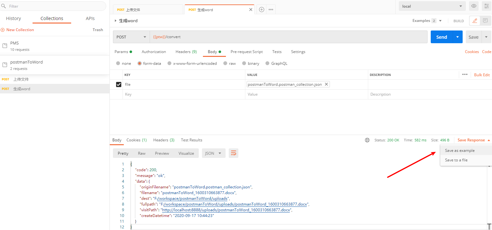
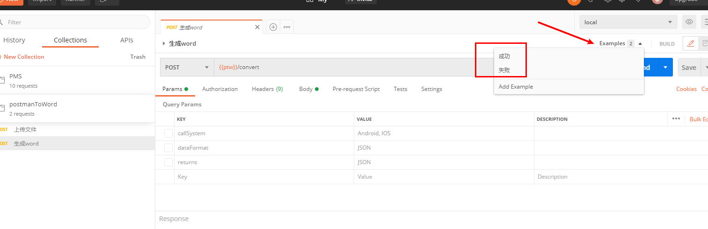
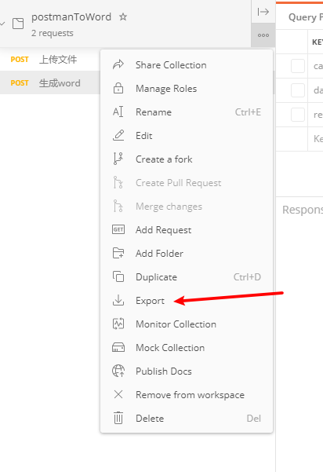
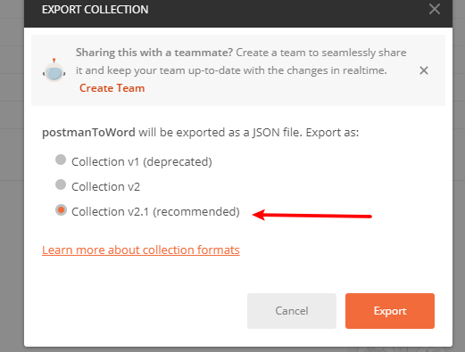
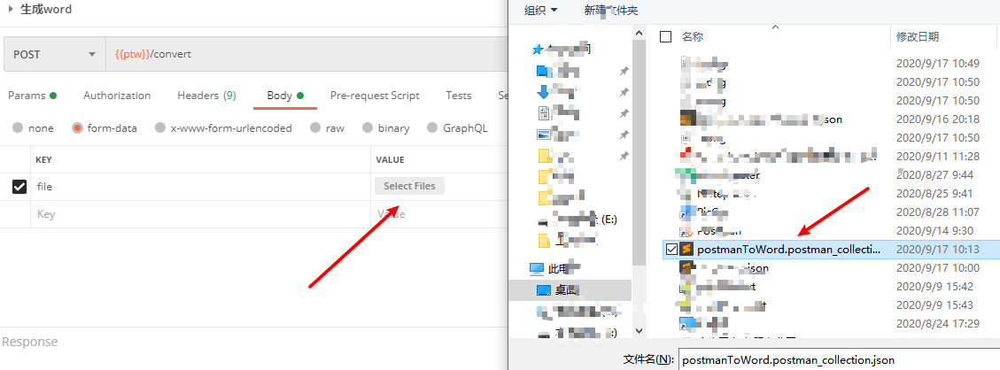
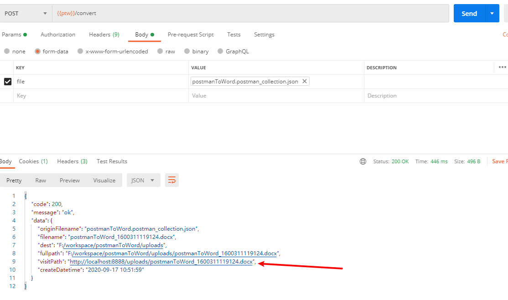
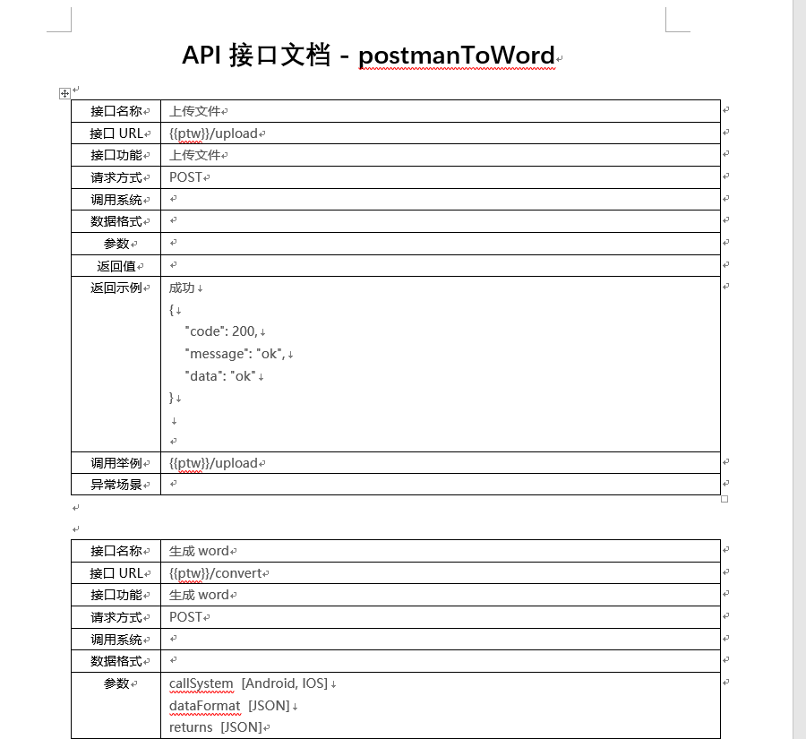

# postmanToWord
很懒，不喜欢写接口文档。现在开发用的是postman调接口，所以就开发这个工具方便大家快速的把postman导出的json转成标准的接口文档。  :laughing:  :laughing: 

## postman
Postman导出Collection v2.1类型的JSON文件转为WORD标准接口文档

### 操作流程
1. postman请求接口并保存返回结果为一个example

2. 为example命令，一般一个成功的返回和一个失败的返回即可

3. 导出这个接口所属的Collection

4. 导出v2.1版本

5. 运行这个项目，并调用convert接口把json转换成word接口文档

6. 调用convert接口会返回一个对象，核心请求数据在visitPath

7. 打开visitPath链接地址，会下载一个接口文档word

